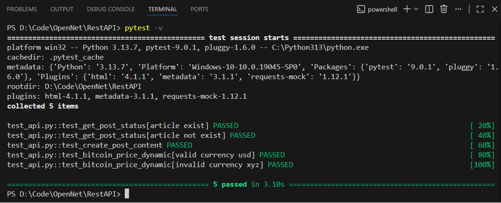

## Note:
在實作中，我特別使用了 pytest.mark.parametrize 的 ids 參數來提升測試報告的可讀性
，確保 QA 或開發人員在查看失敗案例時，能一眼看出是哪組測試數據
（如 post_id 或 status code）出了問題。
## Test Cases:

| Test Case ID | Test Scenario | Test Steps | Expected Result | Validation Method |
| --- | --- | --- | --- | --- |
| API-01 | Positive: Get existing post | Call GET /posts/1 | Status code 200 and returns correct post data. | Verify status_code == 200 and check if id in response matches request. |
| API-02 | Negative: Get non-existent post | Call GET /posts/999 | Status code 404. | Verify status_code == 404 to ensure proper error handling for invalid resources. |
| API-03 | Positive: Create a new post | Call POST /posts with valid JSON payload. | Status code 201 and returns the created object with a new ID. | Verify status_code == 201 and validate that title in response matches the payload. |
| API-04 | Positive: Get BitCoin price in USD | Call GET /simple/price with valid JSON params. | Status code 200 and updated_time less than 5 min | Verify status_code == 200 and validate updated_time, vs_currency ="usd" in the response.json()|
| API-05 | Negative: Get BitCoin price with nonexist currency xyz | Call GET /simple/price with valid JSON params but wrong vs_currency | Status code 200 but has no price | Verify status_code == 200 and validate updated_time, vs_currency ="xyz" has no data in the response.json()|

## Test Result
